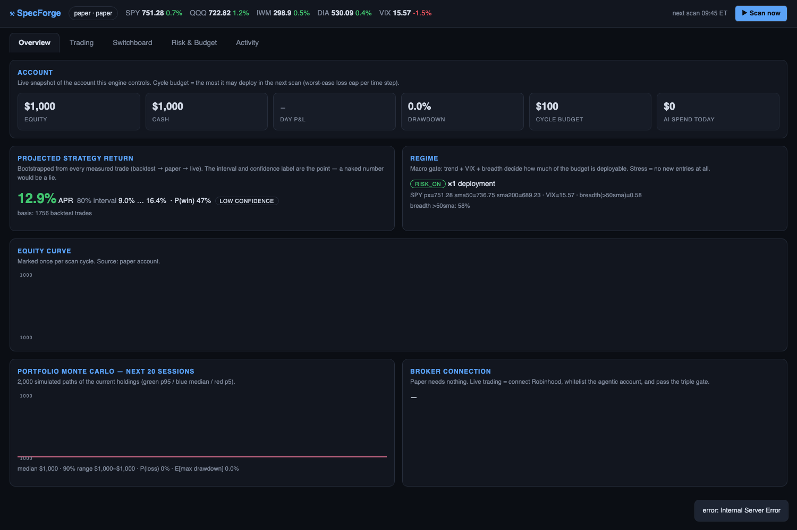
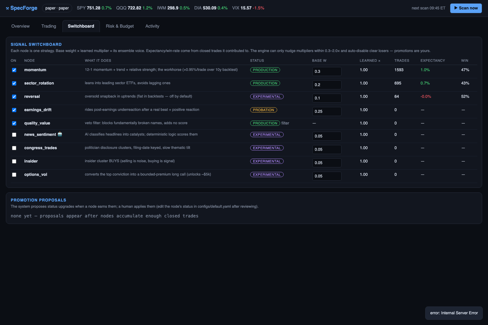

# SpecForge

A modular, risk-bounded, self-improving speculation engine. The "brain" is a
**switchboard of explainable strategy nodes** (momentum, short-term reversal,
sector rotation, earnings drift, congress trades, insider clusters, AI news
sentiment, options convexity) combined by a regime-conditioned ensemble, gated
by a deterministic **risk governor**, and executed through pluggable broker
adapters — Robinhood's Agentic Trading MCP first, paper broker always.

**This system trades real money when you tell it to. You can lose everything
you fund it with. It enforces bounded risk per time step — it does not promise
profits.**

## What it is (60 seconds)

```
Data → Signal nodes → Regime gate → Ensemble (+error bars) → Portfolio
     → Risk governor (time-step budget, caps, kill switches)
     → Broker review → Execution → Attribution → Weight learning
```

- **Nodes emit forecasts, never orders.** The deterministic governor has final
  veto; AI has no path around it.
- **The time-step budget is the core safety primitive**: the worst-case loss of
  everything opened in one scan cycle is capped (default 10% of equity, hard $
  ceiling, scaled down by regime stress to zero).
- **Self-improvement is statistics, not vibes**: closed trades update per-node
  scorecards; weight multipliers move within [0.3×, 2×] with Bayesian shrinkage;
  chronically negative nodes auto-disable; promotions need a human.
- **Every projection ships with error bars** bootstrapped from measured trades
  (backtest → paper → live), labeled with a confidence basis.
- **Bounded instruments only**: long equities/ETFs and long calls/puts (max
  loss = premium). No shorting, no naked options, no margin, ever.




## Quick start

**Double-click (macOS):** build `Stonk.app` once, then it lives wherever you
put it (Applications, Desktop, Dock) and starts the control center on click:

```bash
./scripts/build_stonk_app.sh          # → ~/Applications/Stonk.app (custom icon)
```

The app attaches to a running server if one is up, otherwise boots `--mode live`
and opens the dashboard. It's a launcher for this repo's `.venv` (not a frozen
binary), so keep the repo at `~/Documents/code/stonk`.

**Terminal:**

```bash
./run.sh                 # creates .venv, installs, smoke-tests, starts the GUI
# → http://127.0.0.1:8420

./scripts/install_service.sh          # optional: run at login + auto-restart (macOS)
```

Or manually:

```bash
python3 -m venv .venv && .venv/bin/pip install -e ".[dev]"
.venv/bin/specforge data --full        # ~2 min: full daily history, 46 symbols
.venv/bin/specforge backtest --years 10 --tag v1   # validation + analog trades
.venv/bin/specforge scan               # one full paper scan cycle right now
.venv/bin/specforge serve              # GUI + scheduler (paper mode)
```

Paper mode is the default and needs **no keys or accounts**.

## Going live (Robinhood)

Read [TUTORIAL.md](TUTORIAL.md) first. Short version:

1. Fund a Robinhood **Agentic account**; note its account number.
2. `cp .env.example .env`, set `LIVE_TRADING_ENABLED=true` and
   `RH_ACCOUNT_WHITELIST=<account_number>`.
3. Paper-trade until the §32 safety gates pass (the tutorial lists them).
4. `.venv/bin/specforge --mode live serve` — live config starts with a
   **$50/cycle** budget cap. First OAuth run opens a browser.
5. If Robinhood rejects custom MCP clients, switch `broker: robinhood_bridge`
   in `configs/live.yaml` and schedule a Claude Code session with
   [scripts/bridge_prompt.md](scripts/bridge_prompt.md) as the prompt.

Orders above the approval threshold (default 10% of equity) wait in the GUI
approval queue; everything else runs autonomously inside the budget.

## The switchboard

| Node | Kind | Default | What it trades on |
|---|---|---|---|
| momentum | deterministic | on, w=0.30 | 12-1 momentum, trend, relative strength |
| sector_rotation | deterministic | on, w=0.20 | sector ETF relative strength |
| earnings_drift | deterministic | on, w=0.25 | post-earnings beat + confirmation |
| reversal | deterministic | on, w=0.10 | oversold snapback in uptrends |
| quality_value | filter | on | vetoes fundamentally broken names |
| macro regime | gate | always | SPY trend + VIX + breadth → deployment × |
| news_sentiment | AI (~<$1/day) | off | headline catalyst classification |
| congress_trades | data | off | politician disclosure clusters (filing-date) |
| insider | data | off | insider cluster buys |
| options_vol | overlay | off (auto-locks <~$5k) | converts top conviction into long calls |

Toggle, weight, and budget all of it from the GUI. AI model + daily budget are
configurable (OpenRouter-compatible; defaults to a cheap DeepSeek model) with a
reserve-then-commit ledger that skips work rather than half-spending.

## Repo map

Implementation-level docs live in [dev/](dev/): [ARCHITECTURE.md](dev/ARCHITECTURE.md)
(module map + invariants), [DECISIONS.md](dev/DECISIONS.md) (decision log),
[PROGRESS.md](dev/PROGRESS.md) (handoff state), [PLAN.md](dev/PLAN.md) (build plan).
[AGENTS.md](AGENTS.md) is the canonical architecture spec.

## Verification

```bash
.venv/bin/pytest tests/ -q     # 24 offline tests: governor, budget, kill
                               # switches, no-lookahead, bridge, AI budget, weights
.venv/bin/specforge backtest --years 10 --tag v1   # walk-forward, costs included
```

Backtest reports land in `dev/reports/` with in/out-of-sample splits and an
SPY buy-hold comparison. Treat backtests as hostile evidence.
